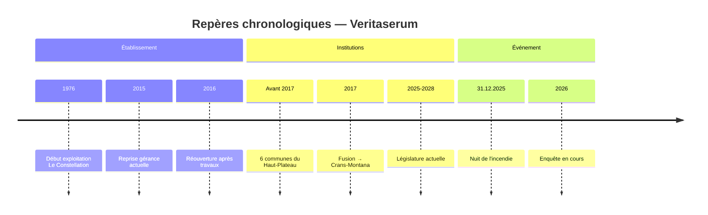

# Chronologie des faits – Incendie de Crans-Montana

## Objet
Cette note recense uniquement des faits datés et vérifiables. En l'absence de source officielle, les éléments restent en TODO et sont consignés dans [[Questions_factuelles_à_clarifier]].

## Repères chronologiques (vue macro)

> [!wip] 🚧 Timeline provisoire
> Les dates ci-dessous sont des repères à confirmer par des sources officielles. Voir les sections détaillées pour l'état de documentation de chaque élément.

## Périmètre
### Périmètre temporel

> [!question] 📂 Source recherchée
> **Élément manquant** : Dates de début et de fin du périmètre d'analyse factuelle (ex: date d'ouverture du Constellation → date de l'événement)
> **Type de preuve attendue** : Documents officiels d'autorisation d'exploiter, articles de presse datés, communications officielles
> **Piste suggérée** : Archives communales Crans-Montana, registre du commerce VS, archives presse locale

### Périmètre des sources

> [!missing] 🔍 À documenter
> Cette section devrait définir les critères d'admissibilité des sources pour garantir la fiabilité factuelle.
> **Périmètre attendu** : hiérarchie des sources (documents officiels > médias traditionnels > témoignages), critères de corroboration
> **Pistes suggérées** : Adapter les standards journalistiques (BBC Editorial Guidelines, méthodes fact-checking AFP)

## Chronologie (structure)
### Avant l'événement

> [!missing] 🔍 À documenter
> Cette section devrait documenter le contexte factuel précédant l'événement.
> **Périmètre attendu** : historique de l'établissement, autorisations, contrôles, modifications structurelles, changements d'exploitant
> **Pistes suggérées** : [[Autorisation_d_exploiter]], [[Procédures_de_contrôle]], archives communales

### Nuit de l'événement

> [!question] 📂 Source recherchée
> **Élément manquant** : Chronologie factuelle précise de la nuit (heure d'alerte, intervention pompiers, évacuation, bilan)
> **Type de preuve attendue** : Rapport pompiers/police, communiqués officiels canton/commune, procès-verbal intervention
> **Piste suggérée** : Ministère public VS, Police cantonale, CSI Crans-Montana, communications officielles canton

### Après l'événement (immédiat)

> [!question] 📂 Source recherchée
> **Élément manquant** : Actions immédiates post-événement (fermeture, sécurisation, premières communications publiques)
> **Type de preuve attendue** : Arrêtés municipaux, communiqués de presse commune/canton, ordonnances d'urgence
> **Piste suggérée** : Site web commune Crans-Montana, archives médias locaux (Le Nouvelliste), communiqués canton VS

### Suite (enquête / décisions)

> [!question] 📂 Source recherchée
> **Élément manquant** : Jalons publics de l'enquête et décisions administratives/judiciaires connues
> **Type de preuve attendue** : Communiqués Ministère public, décisions administratives publiées, articles de presse corroborés
> **Piste suggérée** : Ministère public VS, commune Crans-Montana, médias locaux (dates de parution)

## Éléments établis vs éléments à clarifier
### Éléments établis

> [!missing] 🔍 À documenter
> Cette section devrait lister les faits définitivement confirmés par sources officielles multiples.
> **Périmètre attendu** : faits corroborés par ≥2 sources indépendantes ou 1 source officielle de premier rang
> **Pistes suggérées** : Synchroniser avec les sections chronologiques une fois documentées

### Éléments à clarifier

> [!missing] 🔍 À documenter
> Cette section devrait renvoyer systématiquement à [[Questions_factuelles_à_clarifier]].
> **Périmètre attendu** : questions ouvertes, contradictions entre sources, zones d'ombre documentaires
> **Pistes suggérées** : Créer des liens croisés avec [[Questions_factuelles_à_clarifier]] pour chaque élément

## Liens internes
- [[Questions_factuelles_à_clarifier]]
- [[Procédures_de_contrôle]]
- [[Autorisation_d_exploiter]]
