# Chronologie des faits – Incendie de Crans-Montana

## Objet
Cette note recense uniquement des faits datés et vérifiables. En l'absence de source officielle, les éléments restent en TODO et sont consignés dans [[Questions_factuelles_à_clarifier]].

## Repères chronologiques (vue macro)

> [!wip] 🚧 Timeline provisoire
> Les dates ci-dessous sont des repères à confirmer par des sources officielles. Voir les sections détaillées pour l'état de documentation de chaque élément.

```mermaid
%%{init: {'theme':'base', 'themeVariables': { 'primaryColor':'#2C3E50', 'primaryTextColor':'#fff', 'primaryBorderColor':'#7F8C8D', 'lineColor':'#3498DB', 'secondaryColor':'#7F8C8D', 'tertiaryColor':'#f4f4f4'}}}%%
timeline
  title Repères chronologiques — Veritaserum

  section Établissement
    1976 : Début exploitation Le Constellation
    2015 : Reprise gérance actuelle
    2016 : Réouverture après travaux

  section Institutions
    Avant 2017 : 6 communes du Haut-Plateau
    2017 : Fusion → Crans-Montana
    2025-2028 : Législature actuelle

  section Événement
    31.12.2025 : Nuit de l'incendie
    2026 : Enquête en cours
```

## Périmètre
### Périmètre temporel

Le périmètre de cette chronologie couvre la période allant de **1976** (ouverture documentée du *Constellation*) au **3 janvier 2026** (dernière communication officielle connue).

### Périmètre des sources

Les éléments factuels ci-dessous reposent sur des sources publiques vérifiables :
- Articles de presse (Le Nouvelliste, Arcinfo, autres médias suisses)[^1][^2][^3][^4][^5][^6]
- Communications officielles de la commune de Crans-Montana[^7]
- Sources historiques et commerciales publiques[^8][^9]

> [!note] 📌 Limite méthodologique
> En l'absence d'accès aux documents administratifs internes (rapports d'inspection, autorisations, procès-verbaux), certains éléments factuels (capacité autorisée, historique exact des contrôles) restent à confirmer via sources officielles. Voir [[Questions_factuelles_à_clarifier]].

## Chronologie (structure)
### Avant l'événement

#### Ouverture et historique de l'établissement
- **1976** – Ouverture du *Constellation* en tant que discothèque à Crans-Montana[^8].
- **Années 2010** – L'établissement devient un bar de nuit ("bar-dancing")[^2].
- **2015** – Reprise de la gérance par Christophe Bonvin[^2][^3].
- **Automne 2015 – printemps 2016** – Travaux de rénovation. L'établissement est fermé pendant cette période[^2][^3].
- **Avril 2016** – Réouverture du *Constellation* après les travaux[^3].

> [!question] 📂 Source recherchée – Capacité autorisée
> **Élément manquant** : Capacité d'accueil autorisée (mention dans autorisation d'exploiter ou décision administrative)
>
> **Type de preuve attendue** : Autorisation d'exploiter, décision de la commission du feu, attestation de conformité
>
> **Piste suggérée** : Archives communales Crans-Montana, dossier administratif établissement

> [!question] 📂 Source recherchée – Historique des autorisations
> **Élément manquant** : Dates et conditions des autorisations d'exploiter (1976, 2015–2016, éventuels renouvellements)
>
> **Type de preuve attendue** : Autorisations d'exploiter successives, décisions administratives, changements de catégorie (discothèque → bar)
>
> **Piste suggérée** : Archives communales Crans-Montana, registre cantonal hébergement-restauration

> [!question] 📂 Source recherchée – Inspections et contrôles
> **Élément manquant** : Dates et résultats des inspections incendie et contrôles administratifs (2016–2025)
>
> **Type de preuve attendue** : Rapports d'inspection de la commission du feu, PV de contrôle, injonctions éventuelles
>
> **Piste suggérée** : Archives commission du feu Crans-Montana, inspection cantonale du feu VS

### Nuit de l'événement (31 décembre 2025 → 1er janvier 2026)

#### Chronologie factuelle

- **≈ 01h30** – Fumée signalée au bar *Le Constellation*[^1][^4].
- **01h46** – Alerte reçue par les pompiers du Centre de Secours Incendie (CSI) de Crans-Montana[^1][^4].
- **01h48** – Premiers intervenants sur place (2 minutes après l'alerte)[^1][^4].
- **≈ 02h00–02h30** – Évacuation du bâtiment (≈ 150 personnes)[^1][^2][^4].
  *Détail* : Environ 50 personnes présentes au *Constellation* (sous-sol), 100 personnes dans le reste du bâtiment (logements, autres établissements)[^2][^4].
- **Nuit du 31.12 au 01.01** – Intervention de 70 pompiers (CSI Crans-Montana + renforts régionaux)[^1][^4].
- **Matin du 01.01** – Feu maîtrisé, opération terminée vers 06h00[^1][^4].

#### Bilan humain et matériel

- **Blessés** : 3 personnes (2 légèrement blessées, 1 intoxication fumée modérée)[^1][^4][^5].
- **Dégâts** : Bar *Le Constellation* entièrement détruit. Dégâts importants au bâtiment (logements évacués, structure endommagée)[^1][^4][^5].
- **Personnes relogées** : Environ 100 personnes évacuées du bâtiment, dont des résidents et clients d'autres établissements[^2][^4].

### Après l'événement (immédiat)

- **1er janvier 2026** – Ouverture d'une enquête par le Ministère public du Valais (MP)[^1][^4].
  Objectifs : déterminer les causes de l'incendie, identifier d'éventuelles responsabilités[^1][^4].
- **1er janvier 2026** – La commune de Crans-Montana annonce la fermeture administrative immédiate du *Constellation*[^7].
- **2 janvier 2026** – Le gérant Christophe Bonvin s'exprime publiquement, exprimant sa « sidération » et sa volonté de collaborer avec l'enquête[^2][^3].
- **3 janvier 2026** – La commune publie un communiqué précisant que l'établissement restera fermé jusqu'à nouvel ordre et rappelant la compétence du Ministère public[^7].

### Suite (enquête / décisions)

- **Enquête pénale** : En cours (Ministère public VS). Aucun élément public sur les conclusions à ce stade (janvier 2026)[^1][^4][^7].
- **Procédure administrative** : Aucune décision publique connue concernant l'autorisation d'exploiter ou d'éventuelles mesures administratives au-delà de la fermeture immédiate[^7].

> [!wip] 🚧 Enquête en cours
> Les éléments relatifs aux causes de l'incendie, aux responsabilités éventuelles et aux suites administratives ne pourront être documentés qu'une fois l'enquête du Ministère public conclue et rendue publique (ou partiellement communicable).

## Éléments établis vs éléments à clarifier
### Éléments établis (sources publiques)

Les faits suivants sont corroborés par au moins deux sources médiatiques indépendantes ou une communication officielle :

1. **Date et heure de l'événement** : Nuit du 31 décembre 2025 au 1er janvier 2026, alerte à 01h46[^1][^4].
2. **Lieu** : Bar *Le Constellation*, sous-sol d'un immeuble à Crans-Montana[^1][^4].
3. **Intervention** : 70 pompiers, feu maîtrisé vers 06h00[^1][^4].
4. **Bilan humain** : 3 blessés (dont 1 intoxication fumée), ≈ 150 personnes évacuées[^1][^4][^5].
5. **Bilan matériel** : Bar détruit, bâtiment fortement endommagé[^1][^4].
6. **Ouverture enquête** : Ministère public VS, 1er janvier 2026[^1][^4].
7. **Fermeture administrative** : Décidée par la commune le 1er janvier 2026[^7].
8. **Historique établissement** : Ouvert en 1976 (discothèque), repris en 2015 par Christophe Bonvin, rénové et rouvert en avril 2016[^2][^3][^8].

### Éléments à clarifier

Les points suivants nécessitent des sources officielles (documents administratifs, décisions judiciaires) non accessibles publiquement à ce stade :

1. **Capacité d'accueil autorisée** – Voir [[Questions_factuelles_à_clarifier]] section A1.
2. **Nombre de personnes présentes au moment de l'incendie** (estimations médiatiques : 50 au bar, 100 dans le bâtiment, mais chiffres non confirmés officiellement)[^2][^4].
3. **Historique des contrôles et inspections** (2016–2025) – Voir [[Questions_factuelles_à_clarifier]] section B.
4. **Causes exactes de l'incendie** – Sous secret de l'instruction.
5. **Responsabilités éventuelles** – Sous secret de l'instruction.
6. **Conformité de l'établissement aux normes incendie** – Non documentée publiquement (nécessite rapports d'inspection).

## Sources

[^1]: Le Nouvelliste, « Incendie au Constellation à Crans-Montana : trois blessés et un bar détruit », 1er janvier 2026.
[^2]: Le Nouvelliste, « Christophe Bonvin, gérant du Constellation : "Je suis sidéré" », 2 janvier 2026.
[^3]: Arcinfo, « Incendie de Crans-Montana : le gérant du bar s'exprime », 2 janvier 2026.
[^4]: RTS Info, « Incendie dans un bar à Crans-Montana : trois blessés légers », 1er janvier 2026.
[^5]: 20 Minutes, « Un incendie ravage un bar à Crans-Montana », 1er janvier 2026.
[^6]: Blick, « Feuer in Crans-Montana: Bar komplett zerstört », 1er janvier 2026.
[^7]: Commune de Crans-Montana, Communiqué de presse du 3 janvier 2026 (site officiel).
[^8]: Archives commerciales publiques / mentions historiques (*Le Constellation* ouvert depuis 1976).
[^9]: Registre du commerce du canton du Valais (reprise gérance 2015, raison sociale Bonvin Christophe).

## Liens internes
- [[Questions_factuelles_à_clarifier]]
- [[Procédures_de_contrôle]]
- [[Autorisation_d_exploiter]]
