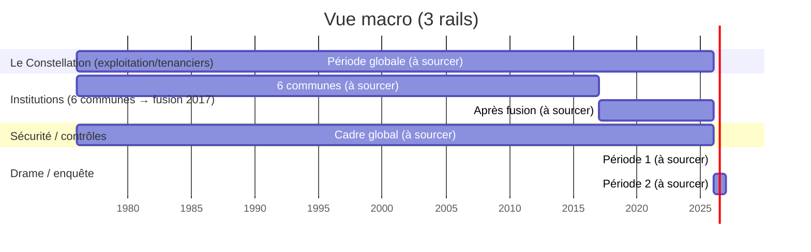
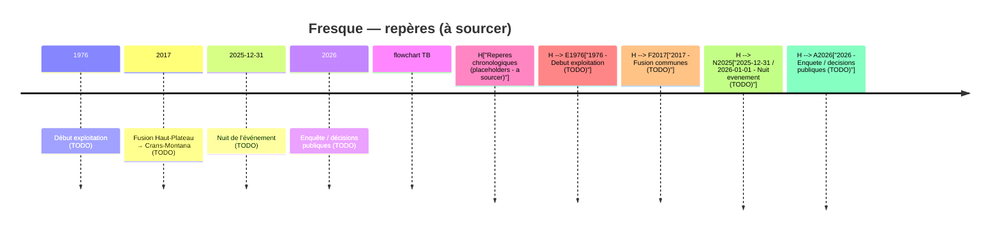
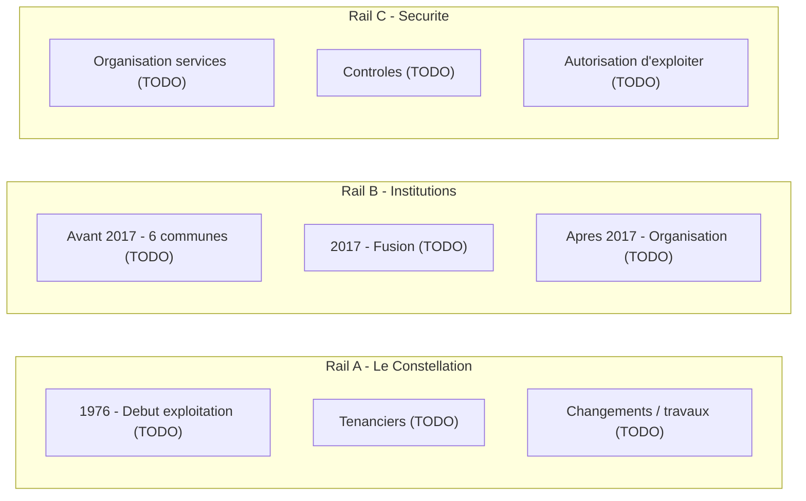

# Fresque chronologique — test visuel

> [!info] Règle d’or
> Pas d’hypothèses. 1 fait = 1 note. Source obligatoire.

Légende: ✅ confirmé / 🟨 à corroborer / ❗ TODO

Dates ci-dessous = repères visuels, à remplacer par dates confirmées.

## Image du lieu

> [!note] Insertion d’image
> Exemple: `![[assets/le_constellation.jpg|Le Constellation — façade (à sourcer)]]`
> Ajoute l’image dans `assets/` et garde un libellé neutre + “à sourcer”.

## Rail A — Le Constellation

> [!warning] 1976 — Début d’exploitation (❗ TODO)
> - Résumé neutre: TODO — à sourcer.
> - Source: TODO — à sourcer.
> - À obtenir: TODO.

> [!warning] Années XXXX — Tenancier #1 (❗ TODO)
> - Résumé neutre: TODO — à sourcer.
> - Source: TODO — à sourcer.
> - À obtenir: TODO.

> [!warning] Années XXXX — Tenancier #2 (❗ TODO)
> - Résumé neutre: TODO — à sourcer.
> - Source: TODO — à sourcer.
> - À obtenir: TODO.

> [!warning] Années XXXX — Changement majeur / travaux (❗ TODO)
> - Résumé neutre: TODO — à sourcer.
> - Source: TODO — à sourcer.
> - À obtenir: TODO.

## Rail B — Institutions (Haut-Plateau → Crans-Montana)

> [!warning] Avant 2017 — 6 communes du Haut-Plateau (❗ TODO)
> - Résumé neutre: TODO — à sourcer.
> - Source: TODO — à sourcer.
> - À obtenir: TODO.

> [!warning] 2017 — Fusion (❗ TODO)
> - Résumé neutre: TODO — à sourcer.
> - Source: TODO — à sourcer.
> - À obtenir: TODO.

> [!warning] Après 2017 — Organisation communale (❗ TODO)
> - Résumé neutre: TODO — à sourcer.
> - Source: TODO — à sourcer.
> - À obtenir: TODO.

## Rail C — Services & sécurité

> [!warning] Organisation sécurité/incendie (❗ TODO)
> - Résumé neutre: TODO — à sourcer.
> - Source: TODO — à sourcer.
> - À obtenir: TODO.

> [!warning] Procédures de contrôle (❗ TODO)
> - Résumé neutre: TODO — à sourcer.
> - Source: TODO — à sourcer.
> - À obtenir: TODO.
> - Lien: [[Procédures_de_contrôle]]

> [!warning] Autorisation d’exploiter (❗ TODO)
> - Résumé neutre: TODO — à sourcer.
> - Source: TODO — à sourcer.
> - À obtenir: TODO.
> - Lien: [[Autorisation_d_exploiter]]

## Tableau récap (à compléter)

| Date | Rail | Fait | Statut | Source |
| --- | --- | --- | --- | --- |
| TODO | A/B/C | TODO | ❗ TODO | à sourcer |

## TODO prioritaires

- [ ] Lister les sources disponibles et les relier aux faits (voir [[Questions_factuelles_à_clarifier]]).
- [ ] Confirmer la période d’exploitation du Constellation (à sourcer) — lier sources.
- [ ] Identifier les communes du Haut-Plateau avant 2017 (à sourcer).
- [ ] Documenter les procédures de contrôle applicables (à sourcer).
- [ ] Clarifier le cadre d’autorisation d’exploiter (à sourcer).

## Liens internes

[[Chronologie]] [[Questions_factuelles_à_clarifier]] [[Procédures_de_contrôle]] [[Autorisation_d_exploiter]]

