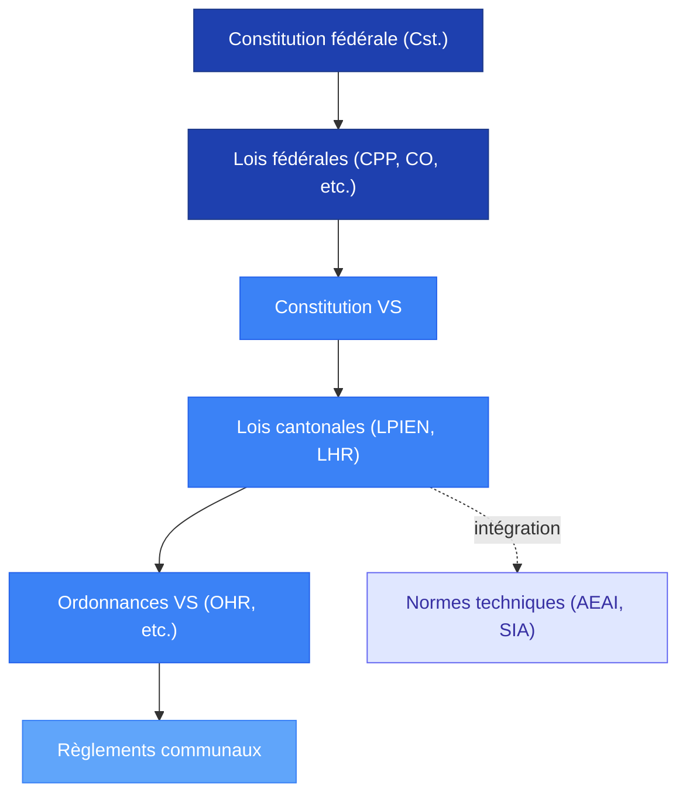

# Lois applicables – Valais (état 2025)

## Objet
Cette note recense les textes applicables à titre de cadrage documentaire, sans interprétation ni analyse.

## Principe de méthode
### Neutralité et prudence

Cette documentation s'inscrit dans le cadre de la présomption d'innocence et du principe de légalité :

- **Présomption d'innocence** : Toute personne est présumée innocente tant qu'elle n'a pas été condamnée par un jugement entré en force (art. 10 al. 1 CPP[^1], art. 32 al. 1 Cst.[^2]).
- **Neutralité documentaire** : Les éléments présentés ici se limitent au cadre juridique applicable, sans attribuer de responsabilité ni interpréter les faits.
- **Séparation enquête/jugement** : Seul le Ministère public instruit pénalement (CPP art. 61 ss[^1]), seul le juge condamne (CPP art. 9[^1]).

> [!note] 📌 Portée de cette documentation
> Les textes recensés ci-dessous définissent le cadre juridique *applicable en général* aux établissements publics et à la protection incendie en Valais. Aucune attribution de responsabilité n'est effectuée à ce stade.

### Hiérarchie des normes

Le système juridique suisse repose sur une hiérarchie des normes[^2][^3] :

**Points clés** :
- **Autonomie communale** : Les communes disposent d'une autonomie organisationnelle et réglementaire dans les limites fixées par le droit cantonal (art. 50 Cst.[^2]).
- **Intégration normes AEAI** : Les prescriptions de protection incendie de l'Association des établissements cantonaux d'assurance incendie (AEAI) sont intégrées dans le droit cantonal valaisan par renvoi législatif (LPIEN art. 3[^4]).
- **Primauté du droit fédéral** : En cas de conflit, le droit fédéral prime (art. 49 al. 1 Cst.[^2]).

## Textes cantonaux principaux (à documenter)
### Tableau des textes (VS)
| Texte | RS | Objet | Lien officiel |
| --- | --- | --- | --- |
| Loi sur la protection contre l'incendie et les éléments naturels (LPIEN) | RS 540.1 | Cadre cantonal : protection incendie + éléments naturels | https://lex.vs.ch/data/540.1/fr |
| Loi sur l'hébergement, la restauration et le commerce de détail de boissons alcoolisées (LHR) | RS 935.3 | Cadre cantonal : établissements / exploitation / alcool | https://lex.vs.ch/data/935.3/fr |
| Ordonnance concernant la LHR (OHR) | RS 935.300 | Dispositions d’exécution de la LHR | https://lex.vs.ch/data/935.300/fr |

### Police du feu / sécurité incendie

**Base légale** : Loi sur la protection contre l'incendie et les éléments naturels (LPIEN, RS 540.1)[^4]

**Dispositions principales** :
- **Art. 1** : Buts – Protection des personnes, animaux, biens contre l'incendie[^4].
- **Art. 2** : Champ d'application – Couvre bâtiments, ouvrages, installations[^4].
- **Art. 3** : Prescriptions de protection incendie – Adopte les prescriptions de l'AEAI (intégration par renvoi)[^4].
- **Art. 4** : Compétences – Répartition canton/communes pour exécution de la loi[^4].
- **Art. 5-6** : Organes – Désignation des organes communaux et cantonaux (commissions du feu, inspection cantonale)[^4].
- **Art. 15** : Contrôles et mesures – Pouvoir d'inspection et de mesures administratives[^4].

**Ordonnance d'exécution** : Ordonnance concernant la LPIEN (RS 540.100)[^5] – Précise modalités d'application, compétences, procédures.

> [!note] 📌 Intégration AEAI
> L'art. 3 LPIEN adopte expressément les prescriptions de protection incendie de l'AEAI[^4], ce qui donne force de loi cantonale aux normes techniques AEAI (voir [[Normes_incendie_AEAI]]).

### Autorisation d'exploiter / établissements publics

**Base légale** : Loi sur l'hébergement, la restauration et le commerce de détail de boissons alcoolisées (LHR, RS 935.3)[^6] + Ordonnance concernant la LHR (OHR, RS 935.300)[^7]

**Dispositions principales (LHR)** :
- **Art. 1** : Champ d'application – Établissements d'hébergement et de restauration[^6].
- **Art. 3** : Autorisation obligatoire – Nul ne peut exploiter un établissement sans autorisation[^6].
- **Art. 4-6** : Conditions d'octroi – Capacités professionnelles, personnelles, locaux conformes[^6].
- **Art. 7** : Procédure – Dépôt dossier, instruction, préavis services techniques[^6].
- **Art. 15-16** : Modification / Transfert – Obligation d'annoncer changements substantiels[^6].
- **Art. 26-28** : Surveillance et mesures – Contrôles, fermeture provisoire/définitive en cas de non-conformité[^6].

**Dispositions d'exécution (OHR)** :
- **Art. 2-5** : Définitions et catégories d'établissements (bars, restaurants, hôtels, etc.)[^7].
- **Art. 6-10** : Dossier de demande (pièces requises, plans, attestations)[^7].
- **Art. 15-18** : Contrôles et sanctions[^7].

> [!question] 📂 Source recherchée – Distinction bar/discothèque
> **Élément manquant** : Critères légaux précis distinguant bar, bar-dancing, discothèque dans l'OHR ou directives d'application
> **Type de preuve attendue** : Article OHR ou circulaire cantonale définissant catégories et exigences différenciées
> **Piste suggérée** : OHR art. 2-5 (définitions), directives service cantonal hébergement-restauration

## Articulation avec droit fédéral
### Procédure pénale (CPP)

**Base légale** : Code de procédure pénale suisse (CPP, RS 312.0)[^1]

**Principes applicables** :
- **Art. 9** : Maxime d'accusation – Seul le Ministère public (MP) poursuit les infractions pénales[^1].
- **Art. 10** : Présomption d'innocence – Toute personne est présumée innocente jusqu'à condamnation[^1].
- **Art. 61-66** : Compétences du Ministère public – Instruction, mise en accusation[^1].
- **Art. 69-73** : Secret de l'instruction – Protection de l'enquête en cours[^1].
- **Art. 118-122** : Constitution de partie civile – Droit des victimes à se constituer partie civile[^1].

**Conséquence pratique** : Tant que l'enquête du MP n'est pas close, les éléments factuels (causes, responsabilités) restent sous secret de l'instruction et ne peuvent être publiquement documentés.

### Responsabilité des collectivités publiques (principes)

**Base légale** : Code des obligations (CO, RS 220), art. 61 (responsabilité causale simple)[^8], applicable aux collectivités publiques valaisannes par renvoi du droit cantonal[^9].

**Conditions cumulatives de responsabilité civile** :
1. **Dommage** : Atteinte effective à un bien juridiquement protégé.
2. **Causalité** : Lien de causalité naturelle et adéquate entre acte/omission et dommage.
3. **Faute ou illicéité** : Violation d'un devoir de diligence ou d'une obligation légale.

**Responsabilité administrative** : Les communes doivent exécuter les tâches déléguées par le canton (police du feu, police du commerce) avec diligence et moyens proportionnés. Le défaut de surveillance ou de contrôle peut engager la responsabilité administrative (voir [[Responsabilité_de_la_commune]]).

> [!note] 📌 Indépendance des responsabilités
> Les trois registres de responsabilité (administrative, civile, pénale) sont **indépendants** : une même situation peut engager simultanément les trois, ou aucune, selon les éléments établis[^9].

## Normes techniques
### AEAI / SIA

**Mécanisme d'intégration** : L'art. 3 LPIEN (RS 540.1) adopte expressément les prescriptions de protection incendie de l'Association des établissements cantonaux d'assurance incendie (AEAI)[^4]. Cela confère **force de loi cantonale** aux normes AEAI en Valais.

**Principales prescriptions AEAI applicables** :
- **Directive AEAI « Protection incendie »** (état 2024)[^10] – Dispositions générales, exigences constructives, installations techniques.
- **Norme de protection incendie** – Voies d'évacuation, compartimentage, détection, extinction[^10].
- **Fiches techniques AEAI** – Détail des exigences par type d'ouvrage et d'installation[^10].

Voir [[Normes_incendie_AEAI]] pour le détail des prescriptions techniques.

**Normes SIA** : Les normes de la Société suisse des ingénieurs et des architectes (SIA) sont reconnues comme règles de l'art en matière de construction[^11]. Elles complètent les prescriptions AEAI sur les aspects structurels et techniques.

## Sources

[^1]: Code de procédure pénale suisse (CPP), RS 312.0 (état 2024). Disponible sur https://www.fedlex.admin.ch/eli/cc/2010/267/fr.
[^2]: Constitution fédérale de la Confédération suisse (Cst.), RS 101 (état 2024). Disponible sur https://www.fedlex.admin.ch/eli/cc/1999/404/fr.
[^3]: Doctrine juridique classique : hiérarchie des normes (Kelsen, *Théorie pure du droit*, 1934 ; ATF 142 I 99 c. 6.1 pour application suisse).
[^4]: Loi sur la protection contre l'incendie et les éléments naturels (LPIEN), RS 540.1 (état 2024). Disponible sur https://lex.vs.ch/data/540.1/fr.
[^5]: Ordonnance concernant la LPIEN, RS 540.100 (état 2024). Disponible sur https://lex.vs.ch/data/540.100/fr.
[^6]: Loi sur l'hébergement, la restauration et le commerce de détail de boissons alcoolisées (LHR), RS 935.3 (état 2024). Disponible sur https://lex.vs.ch/data/935.3/fr.
[^7]: Ordonnance concernant la LHR (OHR), RS 935.300 (état 2024). Disponible sur https://lex.vs.ch/data/935.300/fr.
[^8]: Code des obligations (CO), RS 220 (état 2024), art. 61. Disponible sur https://www.fedlex.admin.ch/eli/cc/27/317_321_377/fr.
[^9]: Doctrine et jurisprudence : Responsabilité des collectivités publiques (ATF 144 II 244 ; Moor/Flückiger/Martenet, *Droit administratif*, vol. III, 2012, n° 7.4.3).
[^10]: AEAI, Prescriptions de protection incendie (état 2024). Disponible sur https://www.praever.ch/fr/bs/vs.
[^11]: SIA, Normes de la construction (état 2024). Disponible sur https://www.sia.ch/fr/.

## Liens internes
- [[Normes_incendie_AEAI]]
- [[Autorisation_d_exploiter]]
- [[Procédures_de_contrôle]]
- [[Responsabilité_de_la_commune]]
