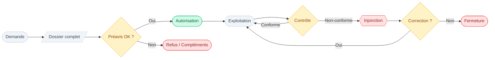

# Autorisation d'exploiter – Conditions, procédure, validité (VS, état 2025)

## Objet

> [!missing] 🔍 À documenter
> Cette section devrait définir l'autorisation d'exploiter comme instrument juridique.
> **Périmètre attendu** : définition légale, fondement (LHR), distinction autorisation de construire/exploiter/servir alcool, durée de validité
> **Pistes suggérées** : LHR (RS 935.3) art. sur autorisation, OHR (RS 935.300) dispositions d'exécution

## Vue d'ensemble du cycle

> [!summary] Cycle simplifié
> Ce schéma illustre le parcours type d'une autorisation d'exploiter, de la demande jusqu'aux contrôles périodiques.

## Bar vs discothèque (distinction)
### Typologie et qualification

> [!question] 📂 Source recherchée
> **Élément manquant** : Critères légaux de distinction bar / discothèque / dancing en droit valaisan
> **Type de preuve attendue** : Articles LHR ou OHR définissant les catégories, ou circulaire cantonale d'application
> **Piste suggérée** : OHR (RS 935.300) annexes ou définitions, service cantonal hébergement/restauration VS

### Impacts pratiques

> [!question] 📂 Source recherchée
> **Élément manquant** : Exigences différenciées selon catégorie (capacité, issues, personnel, horaires)
> **Type de preuve attendue** : Articles réglementaires ou directives cantonales précisant obligations par catégorie
> **Piste suggérée** : OHR conditions par type d'établissement, directives police du commerce VS, normes AEAI établissements à forte affluence

## Procédure d'octroi (vue d'ensemble)
### Autorité compétente

> [!question] 📂 Source recherchée
> **Élément manquant** : Répartition compétences commune/canton pour délivrance autorisation d'exploiter
> **Type de preuve attendue** : Article LHR ou OHR attribuant compétence, ou loi sur organisation communale VS
> **Piste suggérée** : LHR art. sur autorité compétente, pratique commune Crans-Montana (organigramme 2025)

### Dossier de demande (pièces typiques)

> [!missing] 🔍 À documenter
> Cette section devrait lister les pièces constitutives d'une demande d'autorisation.
> **Périmètre attendu** : formulaire-type, attestations, plans, préavis, conditions de capacité
> **Pistes suggérées** : OHR dispositions sur dossier, formulaires-types canton VS, pratique commune Crans-Montana

### Préavis et contrôles préalables

> [!question] 📂 Source recherchée
> **Élément manquant** : Procédure de consultation préalable des services techniques et de police
> **Type de preuve attendue** : Articles réglementaires imposant préavis obligatoires, modèles de décision avec visa des services
> **Piste suggérée** : OHR art. sur instruction des demandes, circulaire administrative canton VS, dossiers-types commune

## Validité / caducité / changements
### Durée et conditions de maintien

> [!question] 📂 Source recherchée
> **Élément manquant** : Durée de validité d'une autorisation d'exploiter et conditions de maintien
> **Type de preuve attendue** : Article LHR/OHR sur durée (illimitée ? renouvelable ?), cas de caducité (cessation activité, non-conformité)
> **Piste suggérée** : LHR/OHR art. sur validité, jurisprudence administrative VS

### Changement d'exploitant

> [!question] 📂 Source recherchée
> **Élément manquant** : Procédure en cas de reprise/changement d'exploitant
> **Type de preuve attendue** : Article imposant nouvelle demande ou simple annonce, délais, pièces requises
> **Piste suggérée** : OHR art. sur transmission/reprise, pratique administrative canton VS

### Changement de catégorie / d'activité

> [!question] 📂 Source recherchée
> **Élément manquant** : Procédure si passage bar → discothèque (ou inverse)
> **Type de preuve attendue** : Article imposant nouvelle instruction complète (préavis feu, capacité, etc.)
> **Piste suggérée** : OHR art. sur modification substantielle, lien avec procédure constructions si impact structurel

## Modifications structurelles (point critique)
### Principe

> [!question] 📂 Source recherchée
> **Élément manquant** : Obligation de réactiver l'instruction en cas de modification structurelle impactant sécurité
> **Type de preuve attendue** : Article LHR/OHR ou norme AEAI imposant réévaluation en cas de travaux
> **Piste suggérée** : OHR art. sur modifications, LPIEN art. sur conformité continue, normes AEAI maintenance

### Cas d'école : escaliers / issues

> [!missing] 🔍 À documenter
> Cette section devrait illustrer l'impact théorique d'une modification d'escalier sur la capacité d'évacuation.
> **Périmètre attendu** : principe AEAI (largeur issue × flux évacuation), exemple générique (sans référence au cas)
> **Pistes suggérées** : Normes AEAI calcul capacité évacuation, directives techniques protection incendie, jurisprudence administrative

## Liens internes
- [[Normes_incendie_AEAI]]
- [[Procédures_de_contrôle]]
- [[Commune de Crans-Montana]]
- [[Questions_factuelles_à_clarifier]]
