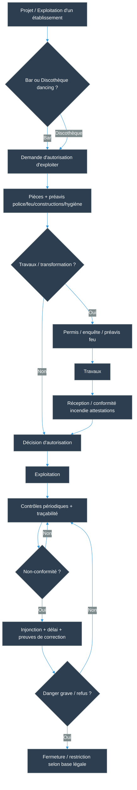
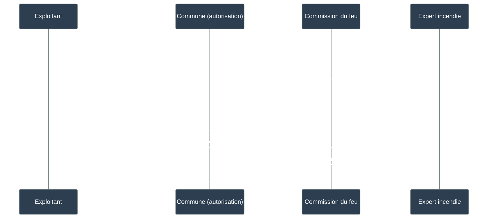

# Carte des autorisations & contrôles – Bars vs Discothèques (Valais, état 2025)

> [!summary] Pourquoi cette note existe
> Objectif : expliquer **simplement** comment un bar / dancing (discothèque) est censé être **autorisé**, **contrôlé** et **tracé** en Valais (état 2025).
>

---

## 1) TL;DR (version "public")
- Un établissement "bars / discothèque" vit dans **2 mondes en parallèle** :  
  1) **Autorisation d'exploiter** (qui peut vendre des boissons, quels horaires, quelle catégorie), via [[Autorisation_d_exploiter]]  
  2) **Sécurité incendie** (évacuation, issues, matériaux, dispositifs), via [[Normes_incendie_AEAI]] et la police du feu
- Une **modification structurelle** (ex. escalier, sorties, sous-sol, capacité) ne relève pas d'un simple détail : c'est souvent un **déclencheur de revalidation** (construire → préavis feu → réception → capacité / conditions).
- Le point "qui fait quoi" (commune/canton/experts) se lit comme une **chaîne** : si un maillon ne documente pas, on perd la traçabilité.

> [!warning] Prudence (important)
> Cette note décrit un **cadre de fonctionnement** (ce qui est censé se passer), pas "ce qui s'est passé" dans une affaire précise.  
> Pour les faits : voir [[Chronologie]] et [[Questions_factuelles_à_clarifier]].

---

## 2) Bar vs Discothèque : la différence "qui change tout"
### 2.1 L'idée intuitive
- **Bar** : public "fluide", densité souvent moindre, ambiance plus éclairée, évacuation plus simple (en général).
- **Discothèque / dancing** : densité forte, obscurité, musique, alcool + comportement de foule → **exigences renforcées** (en pratique).

### 2.2 Ce que tu peux dire au public (sans te piéger)
- "La catégorie administrative n'est pas un détail : elle conditionne souvent la **capacité**, les **horaires**, et le niveau de **sécurité attendu**."
- "Si un lieu ressemble à une discothèque mais est autorisé comme simple bar, la question factuelle n'est pas morale : elle est **documentaire**."

> [!question] Élément à documenter
> **Élément manquant** : Catégorisation exacte dans la LHR / OHR (bar vs dancing) et ses implications juridiques (capacité, horaires, sécurité).
>
> **Type de preuve** : Articles de la LHR (RS 935.3) et de l'OHR (RS 935.300) définissant : catégories d'établissements, critères de distinction, conséquences juridiques.
>
> **Piste suggérée** : Consulter LHR + OHR (sections sur les catégories d'établissements / autorisations) + renvoyer à [[Autorisation_d_exploiter]].
>
> **Pourquoi c'est important** : La catégorisation conditionne le régime juridique applicable : si un lieu fonctionne comme une discothèque mais est autorisé comme bar, il peut y avoir inadéquation entre l'autorisation et l'exploitation réelle.

---

## 3) Les 3 briques légales (à lire comme une carte)
| Brique | À quoi ça sert | Notes / preuves à chercher | Note liée |
|---|---|---|---|
| Autorisation d'exploiter | Autorise l'activité (boissons / accueil / catégorie / conditions) | Décision d'autorisation + annexes + conditions | [[Autorisation_d_exploiter]] |
| Police du feu / incendie | Assure la sécurité du public (évacuation, issues, matériaux, dispositifs) | Préavis feu, rapports d'inspection, injonctions, réception | [[Commission du feu CM]] + [[Normes_incendie_AEAI]] |
| Contrôles & traçabilité | Prouve qu'on a vérifié et corrigé | PV, rapports, délais, preuves de correction | [[Procédures_de_contrôle]] |

---

## 4) Qui signe quoi ?
### 4.1 Autorisation d'exploiter 
- **Autorité signataire** (à confirmer / sourcer précisément) : commune / conseil municipal, selon les textes VS.  
- **Préavis / pièces** : police du commerce, police du feu, constructions, hygiène, ordre public… selon le cas.

> [!warning] Important
> **Une autorisation d'exploiter n'est pas qu'un papier commercial : elle repose normalement sur des préavis et sur la conformité des locaux.**

### 4.2 Police du feu 
- **Organe local** : [[Commission du feu CM]] (inspection, constats, injonctions, délais)
- **Niveau cantonal** : appui / surveillance (à documenter précisément)
- **Experts** : concepts incendie, réception, attestations (souvent indispensables en cas de travaux)

---

## 5) Procédure "autorisation ↔ sécurité" 

## 6) Contrôler quoi, concrètement ? (checklists “sans jargon”)

### 6.1 Sécurité incendie : le minimum compréhensible
- **Évacuation**
  - issues suffisantes (nombre / largeur)

> [!question] Élément à documenter
> **Élément manquant** : Source précise (AEAI / LPIEN) sur les exigences minimales d'évacuation (nombre d'issues, largeur, distance).
>
> **Type de preuve** : Articles des prescriptions AEAI ou de la LPIEN définissant les critères d'évacuation pour établissements publics.
>
> **Piste suggérée** : Consulter [[Normes_incendie_AEAI]] (section Évacuation) + LPIEN.
>
> **Pourquoi c'est important** : Ces exigences conditionnent la capacité admissible du lieu.

  - chemins dégagés (pas d'obstacles, pas de portes verrouillées)
- **Matériaux**
  - plafonds / revêtements compatibles avec un lieu à forte affluence

> [!question] Élément à documenter
> **Élément manquant** : Source précise (AEAI) sur les exigences de réaction au feu des matériaux pour établissements à forte affluence.
>
> **Type de preuve** : Articles des prescriptions AEAI définissant les classes de réaction au feu applicables.
>
> **Piste suggérée** : Consulter [[Normes_incendie_AEAI]] (section Matériaux).
>
> **Pourquoi c'est important** : Les matériaux combustibles peuvent accélérer la propagation du feu.

- **Alerte**
  - alarme audible / visibilité des sorties / éclairage de secours

> [!question] Élément à documenter
> **Élément manquant** : Source précise (AEAI) sur les exigences d'alarme et d'éclairage de secours pour établissements publics.
>
> **Type de preuve** : Articles des prescriptions AEAI définissant les systèmes d'alarme et d'éclairage obligatoires.
>
> **Piste suggérée** : Consulter [[Normes_incendie_AEAI]] (section Détection/alarme/éclairage).
>
> **Pourquoi c'est important** : Ces systèmes permettent l'évacuation en condition dégradée.

- **Exploitation**
  - capacité respectée / gestion de la foule / consignes au personnel

> [!question] Élément à documenter
> **Élément manquant** : Source précise (AEAI / LPIEN / LHR) sur les exigences d'exploitation (capacité, personnel, consignes).
>
> **Type de preuve** : Articles définissant les obligations de l'exploitant en matière de gestion de la sécurité.
>
> **Piste suggérée** : Consulter [[Normes_incendie_AEAI]] + [[Autorisation_d_exploiter]] + [[Procédures_de_contrôle]].
>
> **Pourquoi c'est important** : Le respect de la capacité et les consignes au personnel conditionnent la sécurité en exploitation.

- **Preuves**
  - rapports, photos, attestations, dates

### 6.2 Autorisation d’exploiter : le minimum compréhensible
- “Qui exploite réellement ?” (personne / société)
- “Quelle catégorie ?”
- “Quelles conditions ?” (horaires, capacité, restrictions)
- “Qu’est-ce qui a changé depuis l’ouverture ?” (repris, transformé, agrandi, sous-sol, etc.)

---

## 7) Le cas “escalier rétréci” : pourquoi c’est un point rouge (sans accuser)
> [!danger] Point rouge (purement structurel)
> Rétrécir un escalier qui sert à l’accès/évacuation n’est pas “une rénovation esthétique” : cela peut changer la **capacité d’évacuation** et donc la **capacité admissible** du lieu.

### Chaîne attendue (à vérifier document par document)
1. **Travaux** → permis / dossier technique (si requis)
2. **Préavis feu** → exigences / mesures compensatoires
3. **Réception** → attestation de conformité après travaux
4. **Autorisation d’exploiter** → mise à jour des conditions (capacité, catégorie, restrictions)

## 8) Partie civile : phrase prête à publier (neutre et solide)

> [!info] Formulation “safe”
> “Se porter partie civile, en Suisse, vise en principe à faire valoir un **dommage direct** et à participer à la procédure. Cela ne suffit pas, à lui seul, à établir une responsabilité ou une absence de responsabilité : ce sont deux sujets distincts.”

Voir : [[Responsabilité_de_la_commune]] + (à créer) [[Partie_civile_CPP]].

---

## 9) Grille “10 questions factuelles” (kit communication)

> [!tip] Mode d’emploi
> Publier des **questions**, pas des insinuations. Et demander des **documents**, pas des opinions.

1. Quelle est la **catégorie** administrative officielle (bar vs dancing) ?
2. Quelle est la **capacité autorisée** et où est-elle documentée ?
3. Quelles sont les **conditions** annexées à l’autorisation (horaires, restrictions, sécurité) ?
4. Quelles sont les **issues de secours** officiellement reconnues (plan / réception) ?
5. Quelles **modifications structurelles** ont été autorisées (dates, permis, réception) ?
6. Quels sont les **rapports de contrôles incendie** disponibles (dates, constats, délais) ?
7. Quelles mesures correctives ont été exigées et **prouvées** (photos / attestations) ?
8. Quelles autorités/organes ont produit les **préavis** (feu, constructions, police, hygiène) ?
9. Quel est le **régime de traçabilité** (où sont archivés PV/rapports) ?
10. En cas de non-conformité, quelles **mesures** ont été décidées (restriction/fermeture) ?

👉 Cette liste est à synchroniser avec [[Questions_factuelles_à_clarifier]] (une question = un emplacement “preuve attendue”).

---

## 10) Sources officielles (liens à conserver)
### Textes VS (Lex Valais)
- LPIEN (protection incendie) : 
  https://lex.vs.ch/data/540.1/fr
- Ordonnance d’exécution (incendie) : 
  https://lex.vs.ch/data/540.100/fr
- LHR (hébergement/restauration/boissons) : 
  https://lex.vs.ch/data/935.3/fr
- OHR (ordonnance LHR) : 
  https://lex.vs.ch/data/935.300/fr

### Normes AEAI (références techniques)
- Présentation :
  https://www.bsvonline.ch/fr/prescriptions-de-protection-incendie
- PDF "prescriptions" (lien existant) :
  https://services.vkg.ch/rest/public/georg/bs/publikation/documents/BSPUB-1394520214-55.pdf/content

> [!wip] Prudence - Articles en cours d'extraction
> **État actuel** : Les sources officielles (liens AEAI) sont identifiées, mais les articles précis ne sont pas encore extraits/cités dans les notes.
>
> **Formulation recommandée** : Tant que les articles ne sont pas extraits, rester sur des formulations prudentes :
> **"la loi prévoit / la pratique attend"** + lien officiel + renvoi à [[Normes_incendie_AEAI]].
>
> **Pourquoi c'est important** : Citer des articles inexacts ou incomplets peut fragiliser la crédibilité du propos. Mieux vaut indiquer clairement qu'un élément est en cours de documentation.

---

## 11) Voir aussi (navigation croisée)
- [[Hub]]
- [[Chronologie]]
- [[Questions_factuelles_à_clarifier]]
- [[Lois_applicables]]
- [[Autorisation_d_exploiter]]
- [[Normes_incendie_AEAI]]
- [[Procédures_de_contrôle]]
- [[Commission du feu CM]]
- [[Commune de Crans-Montana]]
- [[Responsabilité_de_la_commune]]

