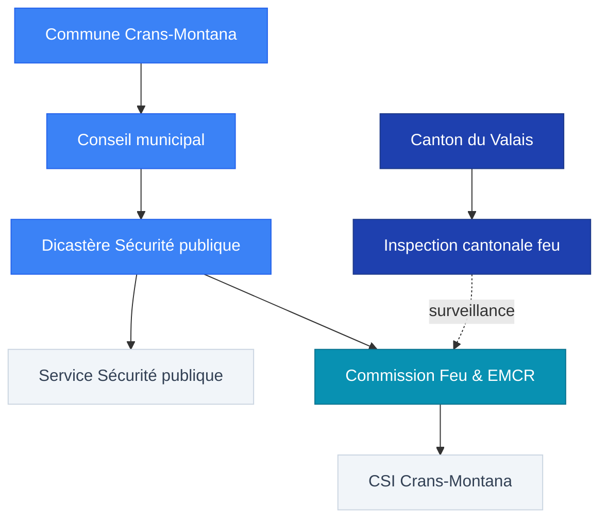

# Commune de Crans-Montana – Rôle institutionnel et compétences (cadre général)

## Objet
Cette note situe la commune comme institution publique dotée d’un exécutif (Conseil municipal), d’une administration structurée en services, et de commissions spécialisées. Le cadrage ci-dessous s’appuie sur l’organigramme administratif publié en 2021; la répartition des dicastères 2025–2028 n’est pas documentée ici faute de source accessible.

Sources
- https://www.commune-cransmontana.ch/media/document/0/vde_mai_2021_n7_final.pdf

## Organigrammes (2021 vs 2025)
### Dicastères 2021 (organigramme administratif)
| Dicastère (2021) |
| --- |
| Finances publiques |
| Domaine public |
| Environnement et énergies |
| Constructions et territoire |
| Économie, tourisme, culture et sports |
| Formation, jeunesse, santé et social |
| Sécurité publique |

### Dicastères 2025 (répartition officielle)
| Dicastère (2025) | Source |
| --- | --- |
| Finances publiques : Nicolas Féraud | https://www.commune-cransmontana.ch/news/legislature-2025--2028-repartition-des-dicasteres-6312 |
| Domaine public : Nicole Bonvin Clivaz | https://www.commune-cransmontana.ch/news/legislature-2025--2028-repartition-des-dicasteres-6312 |
| Environnement, énergies : Jean-Vincent Rey | https://www.commune-cransmontana.ch/news/legislature-2025--2028-repartition-des-dicasteres-6312 |
| Constructions, territoire : François Berclaz | https://www.commune-cransmontana.ch/news/legislature-2025--2028-repartition-des-dicasteres-6312 |
| Économie, affaires rurales, loisirs : Sébastien Rey | https://www.commune-cransmontana.ch/news/legislature-2025--2028-repartition-des-dicasteres-6312 |
| Formation, jeunesse, santé, social : Marielle Clivaz | https://www.commune-cransmontana.ch/news/legislature-2025--2028-repartition-des-dicasteres-6312 |
| Sécurité publique : Patrick Clivaz | https://www.commune-cransmontana.ch/news/legislature-2025--2028-repartition-des-dicasteres-6312 |

### Changements d’intitulés (2021 → 2025)
- Le dicastère « Économie, tourisme, culture et sports » (2021) devient « Économie, affaires rurales, loisirs » (2025).
- Les autres intitulés restent identiques entre 2021 et 2025.

### Chronologie des changements
- Mai 2021: publication de l'organigramme de l'administration communale dans le magazine « Vue d'ensemble » n°07.
- Publication en ligne de la répartition des dicastères 2025–2028.

> [!outdated] Document manquant - Version actualisée
> **Élément manquant** : Organigramme exécutif complet et validé pour la législature 2025–2028 (au-delà de la simple répartition des dicastères).
>
> **Type de preuve** : Organigramme administratif 2025 (publication communale / magazine / annexe au procès-verbal).
>
> **Piste suggérée** : Contacter la Chancellerie communale ou consulter les archives/publications communales 2025.
>
> **Pourquoi c'est important** : L'organigramme 2021 est devenu obsolète, et la simple liste des dicastères 2025 ne documente pas la structure administrative détaillée (services, secteurs, responsables).

### Limites

> [!question] Élément à obtenir
> **Élément manquant** : Organigramme administratif complet 2025 (secteurs détaillés, responsables, rattachements).
>
> **Type de preuve** : Document officiel (organigramme 2025) accessible via publication communale ou demande formelle (transparence/FOI).
>
> **Piste suggérée** : Demander à la Chancellerie communale ou consulter les procès-verbaux/publications communales 2025 (magazine « Vue d'ensemble » ou équivalent).
>
> **Pourquoi c'est important** : Le schéma complet 2025 permettrait de documenter la structure administrative actuelle et d'identifier les services/responsables concernés par les autorisations et contrôles.

### Vue d'ensemble (schéma)

> [!info] Schéma simplifié
> Ce diagramme représente les relations institutionnelles principales. Les lignes pointillées indiquent une relation de surveillance/appui.

Sources
- https://www.commune-cransmontana.ch/media/document/0/vde_mai_2021_n7_final.pdf
- https://www.commune-cransmontana.ch/news/legislature-2025--2028-repartition-des-dicasteres-6312

## Organes communaux pertinents (structure)
### Conseil municipal (exécutif)
- L’organigramme 2021 présente des dicastères rattachés à l’exécutif: finances publiques, domaine public, environnement et énergies, constructions et territoire, économie/tourisme/culture/sports, formation/jeunesse/santé/social, sécurité publique.
- Le président Nicolas Féraud est à la tête de la Chancellerie. Secrétaire communale: Carine Vocat.

Sources
- https://www.commune-cransmontana.ch/media/document/0/vde_mai_2021_n7_final.pdf
- https://www.commune-cransmontana.ch/news/legislature-2025--2028-repartition-des-dicasteres-6312

### Services communaux (administration)
- L’organigramme 2021 présente notamment les services et unités suivants: chancellerie; constructions/territoire (police des constructions, enquêtes publiques, études et projets); domaine public (espaces verts, génie civil, routes et mobilité, travaux publics, voirie); environnement/énergies (eau potable, énergies, irrigation, lacs et digues, PGEE, bisses et torrents, cimetières, déchetteries); finances publiques (cadastre, comptabilité, contentieux, contributions, facturation, informatique, police du commerce).

Sources
- https://www.commune-cransmontana.ch/media/document/0/vde_mai_2021_n7_final.pdf

### Commission du feu
- L’organigramme 2021 mentionne les pompiers (CSI) dans le domaine « Sécurité publique ». Le mandat et les compétences de la Commission du feu doivent être documentés par une source officielle spécifique.

Sources
- https://www.commune-cransmontana.ch/media/document/0/vde_mai_2021_n7_final.pdf

## Compétences (à documenter)
### Autorisation d'exploiter

> [!question] Élément à documenter
> **Élément manquant** : Base légale et autorité compétente (communale/cantonale) pour la délivrance des autorisations d'exploiter.
>
> **Type de preuve** : Articles de la LHR (RS 935.3) / OHR (RS 935.300) + éventuellement règlement communal précisant les compétences.
>
> **Piste suggérée** : Consulter LHR + OHR (sections sur les autorisations) + renvoyer à [[Autorisation_d_exploiter]].
>
> **Pourquoi c'est important** : Identifier l'autorité compétente permet de tracer la chaîne de responsabilité et de déterminer qui signe/valide les autorisations.

### Police du feu / inspections

> [!question] Élément à documenter
> **Élément manquant** : Base légale et autorités de contrôle (commission du feu / canton / experts) pour les inspections incendie.
>
> **Type de preuve** : Articles de la LPIEN (RS 540.1) / ordonnances d'exécution + éventuellement règlement communal sur la commission du feu.
>
> **Piste suggérée** : Consulter LPIEN + ordonnances VS + renvoyer à [[Commission du feu CM]] et [[Procédures_de_contrôle]].
>
> **Pourquoi c'est important** : Identifier les autorités de contrôle permet de tracer la chaîne de responsabilité et de déterminer qui effectue/valide les inspections.

### Mesures administratives (restriction / fermeture)

> [!question] Élément à documenter
> **Élément manquant** : Conditions, procédure et autorités compétentes pour ordonner des mesures administratives (restriction/fermeture).
>
> **Type de preuve** : Articles de la LPIEN / LHR définissant : motifs de fermeture, procédure d'injonction, délais, voies de recours, autorité compétente.
>
> **Piste suggérée** : Consulter LPIEN + LHR (sections sur les mesures administratives / sanctions) + renvoyer à [[Procédures_de_contrôle]].
>
> **Pourquoi c'est important** : Documenter la procédure permet de vérifier si les mesures ont été prises conformément au cadre légal en cas de non-conformité grave.

## Transparence et communication

> [!missing] Élément manquant
> **Élément manquant** : Règles de publication et limites à la transparence (secret de fonction, procédures en cours, protection des données).
>
> **Type de preuve** : Articles du droit cantonal VS / droit fédéral sur la transparence (LTrans / CPP) définissant : ce qui peut être publié, ce qui doit rester confidentiel, exceptions.
>
> **Piste suggérée** : Consulter la loi sur la transparence VS + CPP (procédures pénales en cours) + règles de secret de fonction.
>
> **Pourquoi c'est important** : Clarifier les règles permet de comprendre pourquoi certains documents ne sont pas accessibles et d'éviter de confondre « non publié » avec « inexistant ».

Sources
- https://www.commune-cransmontana.ch/media/document/0/vde_mai_2021_n7_final.pdf
- https://www.commune-cransmontana.ch/news/legislature-2025--2028-repartition-des-dicasteres-6312

## Liens internes
- [[Commission du feu CM]]
- [[Procédures_de_contrôle]]
- [[Responsabilité_de_la_commune]]
