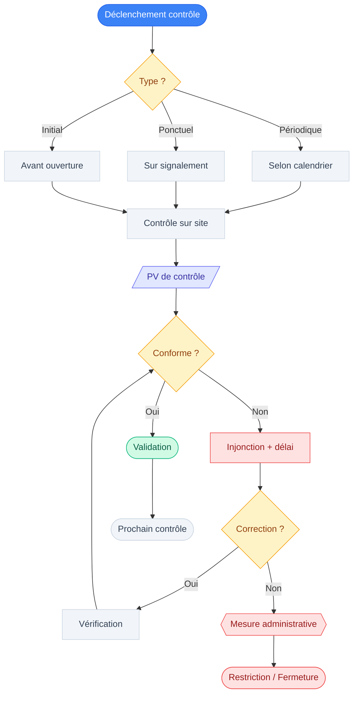

# Procédures de contrôle – Sécurité incendie et exploitation (VS, état 2025)

## Objet
Cette note rassemble les éléments documentaires sur les contrôles liés à la sécurité incendie et à l'exploitation. Les modalités concrètes (périodicité, acteurs, procédures) doivent être précisées à partir des bases légales et documents officiels applicables.

## Processus type (schéma)

> [!summary] Processus de contrôle
> Ce flowchart illustre le déroulement type d'un contrôle de sécurité, du déclenchement jusqu'aux suites éventuelles.

## Types de contrôles
### Contrôle initial (avant ouverture / après travaux)

> [!missing] 🔍 À documenter
> Cette section devrait décrire la procédure de contrôle initial avant mise en exploitation.
> **Périmètre attendu** : qui effectue le contrôle (commission du feu, expert), quelles installations vérifiées, attestation délivrée, lien avec autorisation d'exploiter
> **Pistes suggérées** : Ordonnance RS 540.100 art. sur réception, pratique [[Commission du feu CM]], modèles PV/attestations

### Contrôles périodiques

> [!question] 📂 Source recherchée
> **Élément manquant** : Périodicité légale des contrôles incendie pour établissements publics (bars/discothèques) en Valais
> **Type de preuve attendue** : Article LPIEN, ordonnance ou directive cantonale précisant fréquence (annuelle ? tous les 3 ans ? selon catégorie ?)
> **Piste suggérée** : LPIEN (RS 540.1) ou ordonnance RS 540.100 art. sur contrôles périodiques, directives inspection cantonale du feu VS

### Contrôles ponctuels (sur signalement / événement)

> [!missing] 🔍 À documenter
> Cette section devrait décrire les contrôles déclenchés hors calendrier (plainte, incident, changement).
> **Périmètre attendu** : qui peut déclencher (autorité, tiers, exploitant), procédure, délais d'intervention, conséquences
> **Pistes suggérées** : LPIEN art. sur contrôles extraordinaires, LHR/OHR volet surveillance exploitation, pratique communale

## Qui contrôle quoi ?
### Commune

> [!question] 📂 Source recherchée
> **Élément manquant** : Compétences précises de la commune en matière de contrôle incendie et exploitation
> **Type de preuve attendue** : Articles LPIEN ou LHR attribuant missions de contrôle aux communes, délégation à organes locaux
> **Piste suggérée** : LPIEN art. sur organisation, loi communale VS, organisation [[Commission du feu CM]]

### Canton

> [!question] 📂 Source recherchée
> **Élément manquant** : Compétences du canton en matière de surveillance/contrôle (niveau 2 ou intervention directe)
> **Type de preuve attendue** : Articles LPIEN/LHR sur rôle services cantonaux (inspection, haute surveillance, appui technique)
> **Piste suggérée** : LPIEN art. sur inspection cantonale, organigramme services canton VS (département sécurité)

### Experts tiers

> [!question] 📂 Source recherchée
> **Élément manquant** : Rôle des experts privés en protection incendie (concepts, réception, attestations)
> **Type de preuve attendue** : Articles réglementaires sur recours obligatoire à experts agréés pour certains contrôles/réceptions
> **Piste suggérée** : LPIEN/ordonnance art. sur experts reconnus, registre experts AEAI, pratique canton VS

## Suites de contrôle
### Constats et délais

> [!missing] 🔍 À documenter
> Cette section devrait décrire la forme des constats de contrôle et délais de mise en conformité.
> **Périmètre attendu** : PV de contrôle, injonctions écrites, délais selon gravité, preuve de correction requise
> **Pistes suggérées** : LPIEN/ordonnance art. sur procédure après contrôle, modèles PV/injonctions, pratique [[Commission du feu CM]]

### Mesures administratives

> [!question] 📂 Source recherchée
> **Élément manquant** : Mesures coercitives en cas de non-conformité (restriction d'activité, fermeture provisoire/définitive)
> **Type de preuve attendue** : Articles LPIEN ou LHR sur mesures d'urgence, fermeture, procédure contradictoire
> **Piste suggérée** : LPIEN art. sur fermeture d'office, LHR art. sur retrait d'autorisation, procédure administrative VS

### Escalade (canton / autres autorités)

> [!question] 📂 Source recherchée
> **Élément manquant** : Procédure de remontée au canton si commune défaillante ou danger grave
> **Type de preuve attendue** : Articles LPIEN sur pouvoir de substitution/évocation canton, haute surveillance
> **Piste suggérée** : LPIEN art. sur compétences subsidiaires canton, jurisprudence administrative VS, droit de recours

Sources
- https://lex.vs.ch/data/540.1/fr
- https://lex.vs.ch/data/935.3/fr
- https://lex.vs.ch/data/935.300/fr

## Liens internes
- [[Commission du feu CM]]
- [[Autorisation_d_exploiter]]
- [[Normes_incendie_AEAI]]
- [[Questions_factuelles_à_clarifier]]
