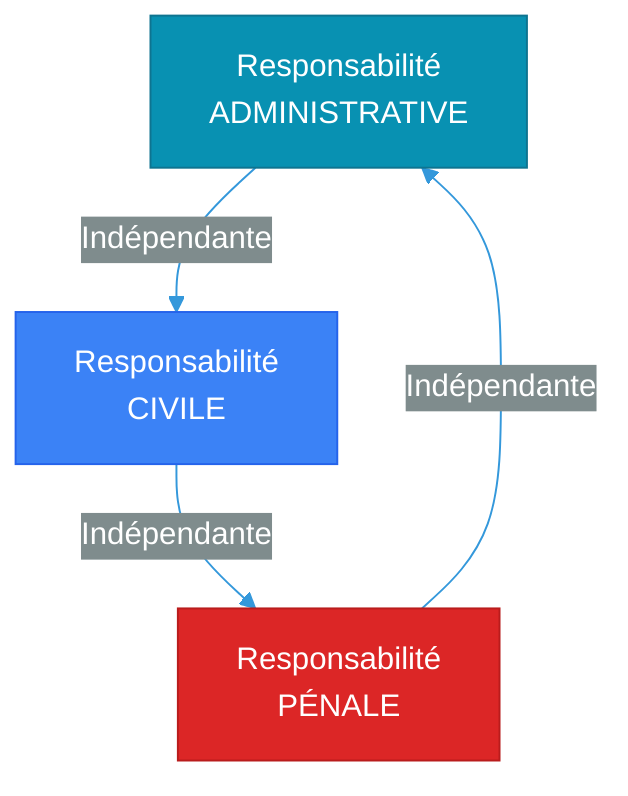
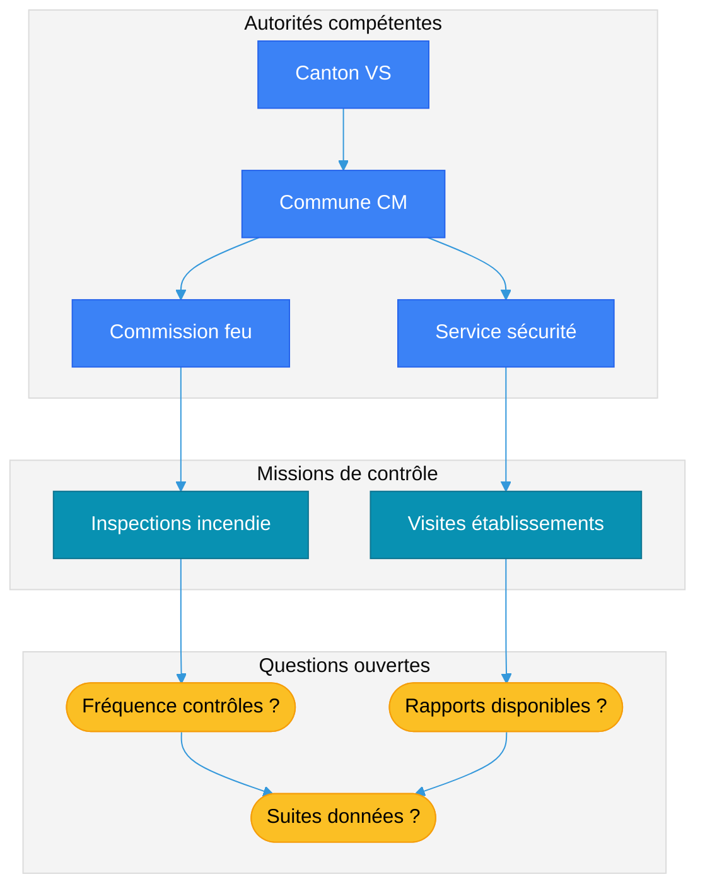

# Responsabilité de la commune – Cadre juridique (sans préjuger des faits)

## Objet

Cette note présente les trois registres de responsabilité applicables aux communes en Suisse, sans attribuer de responsabilité au cas présent. Ces trois registres sont **juridiquement indépendants** : une même situation peut engager les trois simultanément, un seul, ou aucun[^15].

### Les trois registres de responsabilité

**Principe d'indépendance** : Une même situation peut être examinée sous les trois angles. Par exemple, une commune peut être condamnée civilement à réparer un dommage (responsabilité civile), ses organes peuvent être sanctionnés pénalement (responsabilité pénale), et l'autorité de surveillance peut constater un manquement administratif (responsabilité administrative)[^15].

## Vue d'ensemble (acteurs et questions)

> [!info] Schéma des acteurs
> Ce diagramme identifie les acteurs institutionnels impliqués dans la chaîne de contrôle et les questions documentaires ouvertes.

## Responsabilité administrative (exécution des tâches)

### Principe général

Les communes valaisannes sont des **collectivités publiques autonomes** (Constitution VS art. 78 ss)[^16] chargées d'exécuter les tâches qui leur sont déléguées par le droit cantonal. Cette exécution doit respecter les principes généraux du droit administratif[^17] :

1. **Légalité** : Agir conformément au droit (art. 5 al. 1 Cst.).
2. **Diligence** : Exécuter les tâches avec sérieux et compétence.
3. **Proportionnalité** : Mobiliser les moyens adaptés aux risques (art. 5 al. 2 Cst.).
4. **Bonne foi** : Assurer la prévisibilité et la cohérence de l'action administrative (art. 5 al. 3 Cst.).

### Devoirs en matière de protection incendie

**Base légale** : LPIEN (RS 540.1), art. 4-5[^18]

Les communes valaisannes ont pour mission d'**organiser la protection contre l'incendie** sur leur territoire (LPIEN art. 5). Cela comprend notamment :

- **Créer et maintenir une commission du feu** (art. 5 al. 1)[^18].
- **Créer et maintenir un corps de sapeurs-pompiers** (art. 5 al. 1)[^18].
- **Veiller à l'exécution des prescriptions de protection incendie** (art. 6)[^18], incluant :
  - Contrôle périodique des bâtiments et installations.
  - Inspection avant mise en exploitation (nouveaux établissements, travaux).
  - Établissement de rapports d'inspection et suivi des injonctions.

**Obligation de moyens** : La commune doit mettre en œuvre des moyens **proportionnés** au risque. Le manquement à cette obligation (absence de contrôles, moyens manifestement insuffisants) peut engager la responsabilité administrative de la commune[^17].

### Devoirs en matière d'autorisation d'exploiter

**Base légale** : LHR (RS 935.3), art. 26-28[^19]

Les communes sont chargées de **surveiller les établissements** autorisés sur leur territoire (LHR art. 26). Cela comprend :

- **Contrôles réguliers** : Vérifier que les conditions d'exploitation sont respectées (capacité, horaires, conformité aux normes).
- **Mesures administratives** : En cas de non-conformité, la commune peut prendre des mesures provisoires (injonction, restriction d'activité) ou définitives (fermeture, retrait d'autorisation)[^19].
- **Documentation** : Obligation de tenir des dossiers d'établissements et d'archiver les rapports de contrôle[^17].

### Contrôle hiérarchique et substitution

**Principe** : Si une commune ne remplit pas ses obligations, le canton peut intervenir[^18] :

- **Haute surveillance** : Le canton contrôle que les communes exécutent correctement les missions déléguées (LPIEN art. 4)[^18].
- **Pouvoir de substitution** : En cas de carence grave, le canton peut se substituer à la commune et exécuter la tâche à sa place (principe général du droit administratif)[^17].

**Conséquence** : Le défaut de contrôle ou la carence dans l'exécution des tâches peut entraîner une **mise en cause de la responsabilité administrative** de la commune (rappel à l'ordre, substitution, sanctions administratives)[^17].

## Responsabilité civile publique (principes)

### Base légale

**Droit fédéral** : Code des obligations (CO), art. 61 (responsabilité causale simple)[^20]

**Droit cantonal** : Le Valais applique l'art. 61 CO par renvoi pour la responsabilité civile de ses collectivités publiques[^21]. Les communes valaisannes peuvent donc être tenues de réparer les dommages causés par leurs organes dans l'exercice de fonctions publiques.

### Trois conditions cumulatives

Pour engager la responsabilité civile d'une commune, trois conditions doivent être **simultanément** remplies[^20][^21] :

1. **Dommage** : Atteinte effective à un bien juridiquement protégé (intégrité physique, propriété, patrimoine).
   - *Exemple* : Dommages matériels à un bâtiment, préjudice corporel, perte économique.

2. **Causalité** : Lien de causalité naturelle et adéquate entre l'acte/omission de la commune et le dommage.
   - **Causalité naturelle** : Le dommage ne se serait pas produit sans l'acte/omission de la commune.
   - **Causalité adéquate** : Le dommage était une conséquence prévisible et typique de l'acte/omission[^20].

3. **Faute ou illicéité** : Violation d'un devoir de diligence ou d'une obligation légale.
   - *Exemple* : Défaut de contrôle malgré obligation légale, omission de prendre des mesures malgré connaissance d'un risque.

> [!note] 📌 Responsabilité causale simple (art. 61 CO)
> Contrairement à la responsabilité pour faute (art. 41 CO), l'art. 61 CO impose une responsabilité **causale simple** : la collectivité publique répond du dommage dès lors qu'il y a causalité et illicéité, **sans qu'il soit nécessaire de prouver une faute personnelle** d'un organe identifié[^20]. La commune répond civilement des actes de ses organes (conseil municipal, commission du feu, services administratifs) dans l'exercice de leurs fonctions publiques.

### Prescription

**Délai** : L'action en responsabilité civile se prescrit par **10 ans** à compter de la survenance du dommage (art. 127 CO)[^20].

**Interruption** : La prescription est interrompue notamment par l'ouverture d'une procédure judiciaire ou par la reconnaissance de dette de la commune.

## Responsabilité pénale (principes généraux)

### Principe : responsabilité personnelle

**Règle** : En droit pénal suisse, **seules les personnes physiques** peuvent être pénalement responsables (principe de la responsabilité personnelle)[^22]. La commune en tant que personne morale **ne peut pas être condamnée pénalement**.

**Conséquence** : Si des infractions pénales sont établies, seuls les **organes communaux** (conseillers municipaux, membres de commissions, employés communaux) peuvent être personnellement mis en cause[^22].

### Infractions par négligence

**Base légale** : Code pénal (CP), art. 12[^22]

Les infractions peuvent être commises **intentionnellement** (art. 12 al. 2 CP) ou **par négligence** (art. 12 al. 3 CP). Dans le contexte de la surveillance administrative, les infractions par négligence sont les plus fréquentes :

- **Négligence** : Violation d'un devoir de diligence par manque de précaution, d'attention ou de prévoyance.
  - *Exemple* : Omettre de contrôler un établissement malgré obligation légale, ne pas donner suite à un rapport d'inspection signalant des risques.

### Infractions pénales potentiellement applicables

Les infractions pénales suivantes peuvent, en théorie, être invoquées en cas de manquement grave d'un organe communal (sans préjuger de leur application au cas présent)[^22][^23] :

1. **Art. 117 CP – Lésions corporelles par négligence**
   - Conditions : Atteinte à l'intégrité corporelle d'autrui par négligence.
   - *Exemple théorique* : Si un défaut de contrôle entraîne un accident corporel.

2. **Art. 229 CP – Mise en danger par négligence**
   - Conditions : Création d'un danger pour la vie ou l'intégrité d'autrui par violation d'un devoir de diligence.
   - *Exemple théorique* : Omettre de prendre des mesures malgré connaissance d'un danger grave.

3. **Art. 312 CP – Abus d'autorité**
   - Conditions : Abus de pouvoir dans l'exercice de fonctions publiques (généralement intentionnel).

4. **Art. 314 CP – Violation du secret de fonction**
   - Conditions : Divulgation de secrets appris dans l'exercice de fonctions publiques.

> [!note] 📌 Secret de l'instruction
> Tant que l'enquête du Ministère public est en cours, il est **impossible de déterminer** si des infractions pénales ont été commises et, le cas échéant, par qui. Seul le Ministère public peut instruire et seul le juge peut condamner (CPP art. 9, 61 ss)[^24].

### Prescription

**Délais de prescription** (art. 97 CP)[^22] :
- **Crime** (≥ 3 ans de peine) : 15 ans.
- **Délit** (< 3 ans de peine) : 10 ans.
- **Contravention** : 3 ans.

La prescription commence à courir dès la commission de l'infraction et est interrompue par tout acte de procédure (art. 97 al. 3 CP).

## Limites et prudence

### Séparation des pouvoirs

La Constitution fédérale (art. 51 Cst.) et la Constitution valaisanne consacrent le principe de **séparation des pouvoirs**[^25] :

- **Pouvoir législatif** : Grand Conseil (canton), Conseil général (commune).
- **Pouvoir exécutif** : Conseil d'État (canton), Conseil municipal (commune).
- **Pouvoir judiciaire** : Tribunaux cantonaux, Ministère public.

**Conséquence** : Seules les autorités judiciaires (Ministère public, juges) sont compétentes pour établir des responsabilités pénales et prononcer des condamnations. Les autorités administratives (communes, canton) ne peuvent ni instruire pénalement, ni condamner pénalement.

### Compétences exclusives

1. **Instruction pénale** : Seul le **Ministère public** peut instruire une affaire pénale (CPP art. 61 ss)[^24].
2. **Condamnation pénale** : Seul le **juge pénal** peut condamner une personne (CPP art. 9)[^24].
3. **Contrôle administratif** : Seules les **autorités de surveillance** (inspection cantonale, département cantonal compétent) peuvent constater un manquement administratif et prononcer des sanctions administratives[^17].

### Présomption d'innocence

**Principe constitutionnel** : Toute personne est présumée innocente tant qu'elle n'a pas été condamnée par un jugement entré en force (art. 32 al. 1 Cst., art. 10 al. 1 CPP)[^24][^25].

**Conséquence** : Tant que l'enquête du Ministère public n'est pas close et qu'aucun jugement n'a été rendu, **aucune responsabilité pénale ne peut être attribuée**. Toute affirmation contraire constituerait une **violation de la présomption d'innocence**.

> [!warning] ⚠️ Portée de ce document
> Ce document présente uniquement le **cadre juridique général** applicable aux communes suisses en matière de responsabilité administrative, civile et pénale. **Aucune attribution de responsabilité** n'est effectuée dans le cas présent. Seules les autorités compétentes (Ministère public, tribunaux, autorités de surveillance) peuvent établir des responsabilités après instruction complète et contradictoire.

## Sources

[^15]: Doctrine et jurisprudence : Responsabilité des collectivités publiques (ATF 144 II 244 ; Moor/Flückiger/Martenet, *Droit administratif*, vol. III, 2012, n° 7.4.3 sur l'indépendance des responsabilités).
[^16]: Constitution du canton du Valais (état 2024), art. 78 ss. Disponible sur https://lex.vs.ch/data/101/fr.
[^17]: Principes généraux du droit administratif suisse : Grisel, *Traité de droit administratif*, 1984 ; Häfelin/Müller/Uhlmann, *Allgemeines Verwaltungsrecht*, 8e éd., 2020.
[^18]: Loi sur la protection contre l'incendie et les éléments naturels (LPIEN), RS 540.1 (état 2024), art. 4-6. Disponible sur https://lex.vs.ch/data/540.1/fr.
[^19]: Loi sur l'hébergement, la restauration et le commerce de détail de boissons alcoolisées (LHR), RS 935.3 (état 2024), art. 26-28. Disponible sur https://lex.vs.ch/data/935.3/fr.
[^20]: Code des obligations (CO), RS 220 (état 2024), art. 61, 127. Disponible sur https://www.fedlex.admin.ch/eli/cc/27/317_321_377/fr.
[^21]: Jurisprudence du Tribunal fédéral : ATF 144 II 244 (responsabilité causale simple des collectivités publiques), ATF 133 III 462 (causalité adéquate).
[^22]: Code pénal suisse (CP), RS 311.0 (état 2024), art. 12, 97, 117, 229, 312, 314. Disponible sur https://www.fedlex.admin.ch/eli/cc/54/757_781_799/fr.
[^23]: Doctrine pénale : Stratenwerth/Bommer, *Schweizerisches Strafrecht, Allgemeiner Teil II*, 2e éd., 2018 (négligence pénale et devoir de diligence).
[^24]: Code de procédure pénale suisse (CPP), RS 312.0 (état 2024), art. 9, 10, 61 ss. Disponible sur https://www.fedlex.admin.ch/eli/cc/2010/267/fr.
[^25]: Constitution fédérale de la Confédération suisse (Cst.), RS 101 (état 2024), art. 32, 51. Disponible sur https://www.fedlex.admin.ch/eli/cc/1999/404/fr.

## Liens internes
- [[Lois_applicables]]
- [[Procédures_de_contrôle]]
- [[Commune de Crans-Montana]]
- [[Questions_factuelles_à_clarifier]]
