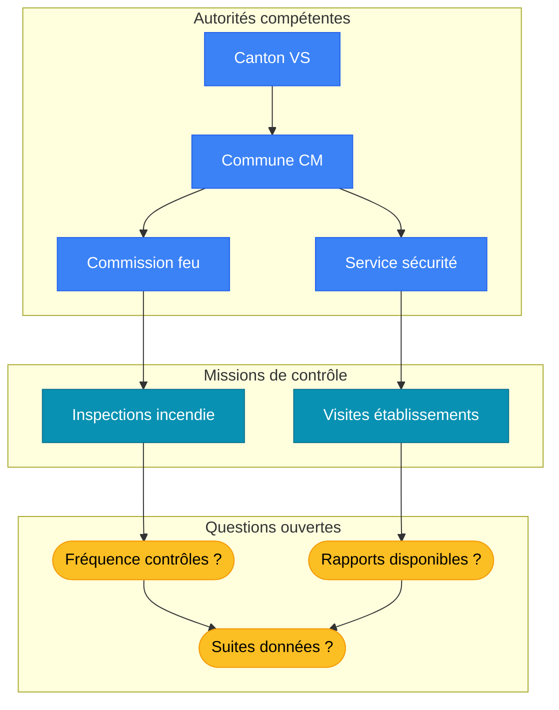

# Responsabilité de la commune – Cadre juridique (sans préjuger des faits)

## Objet

> [!missing] 🔍 À documenter
> Cette section devrait distinguer les trois registres de responsabilité sans les attribuer au cas.
> **Périmètre attendu** : responsabilité administrative (exécution lois), civile (dommages), pénale (infractions), indépendance des trois
> **Pistes suggérées** : Schéma comparatif, jurisprudence TF sur cumul responsabilités, art. 61 CO (responsabilité causale simple)

## Vue d'ensemble (acteurs et questions)

> [!info] Schéma des acteurs
> Ce diagramme identifie les acteurs institutionnels impliqués dans la chaîne de contrôle et les questions documentaires ouvertes.

## Responsabilité administrative (exécution des tâches)

> [!missing] 🔍 À documenter
> Cette section devrait expliciter les devoirs administratifs des communes en matière de sécurité publique.
> **Périmètre attendu** : devoir d'exécuter les lois (police constructions, police du feu, police du commerce), devoir de documenter/archiver, moyens proportionnés
> **Pistes suggérées** : LPIEN art. sur missions communes, LHR art. sur surveillance, principes généraux droit administratif (diligence, proportionnalité)

## Responsabilité civile publique (principes)

> [!missing] 🔍 À documenter
> Cette section devrait présenter les conditions de mise en cause civile d'une commune.
> **Périmètre attendu** : 3 conditions cumulatives (dommage, causalité, faute/illicéité), responsabilité causale simple (art. 61 CO par renvoi), prescription
> **Pistes suggérées** : Loi VS sur responsabilité collectivités publiques (si existe), jurisprudence TF responsabilité causale simple, ATF pertinents

## Responsabilité pénale (principes généraux)

> [!missing] 🔍 À documenter
> Cette section devrait expliquer les conditions de mise en cause pénale des organes communaux.
> **Périmètre attendu** : responsabilité personnelle des organes/agents (pas de responsabilité pénale de la personne morale commune), infractions par négligence (art. CP), conditions (devoir de diligence violé, causalité, imprudence/négligence)
> **Pistes suggérées** : CP art. 12 (négligence), art. 229 (mise en danger par négligence si applicable), jurisprudence TF responsabilité organes

## Limites et prudence

> [!missing] 🔍 À documenter
> Cette section devrait rappeler la séparation des pouvoirs et la compétence exclusive des autorités judiciaires/administratives.
> **Périmètre attendu** : seul le Ministère public instruit pénalement, seul le juge condamne, contrôles administratifs indépendants (inspection cantonale, autorités de surveillance)
> **Pistes suggérées** : CPP art. sur compétences MP/juges, Constitution VS art. sur séparation pouvoirs, principe présomption d'innocence

## Liens internes
- [[Lois_applicables]]
- [[Procédures_de_contrôle]]
- [[Commune de Crans-Montana]]
- [[Questions_factuelles_à_clarifier]]
